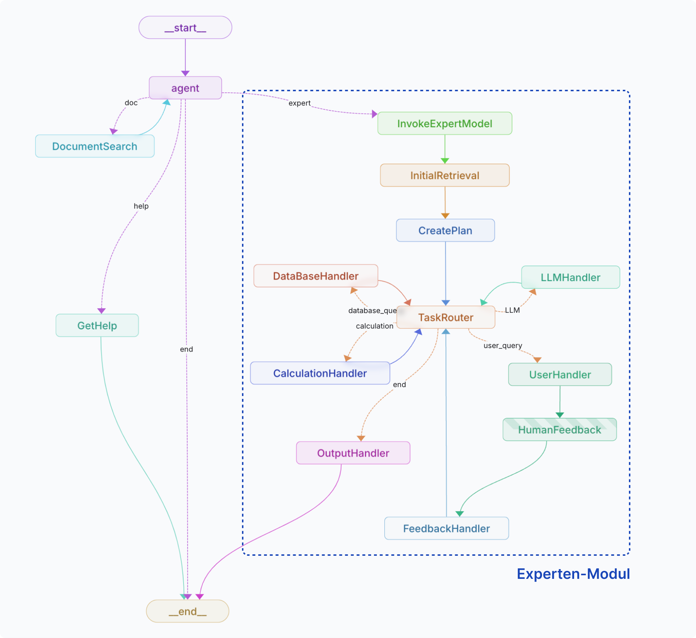

# Companion Repository to the Masters Thesis "Natural Language Processing for Standards"

This repository contains the source code of the base application logic without the dedicated UI, as well as a few helper notebooks for the data ingetion process and benchmark.

