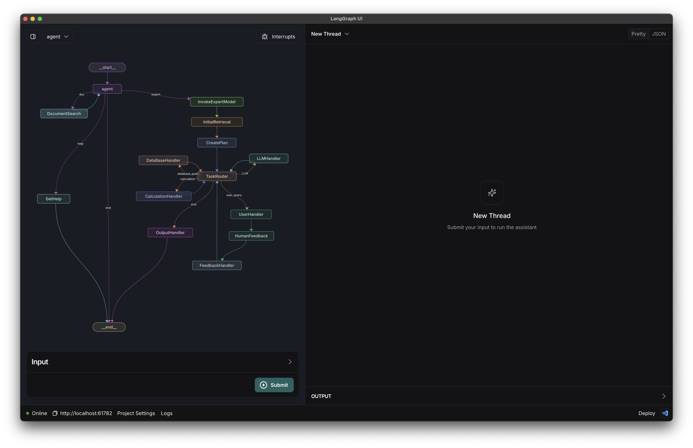

# Companion Repository to the Masters Thesis "Natural Language Processing for Standards"

This repository contains the source code of the base application logic without the dedicated UI, as well as a few helper notebooks for the data ingetion process and benchmark.


## NormGraph base application
The base application directory is structured as follows:
```
LANGGRAPH-BASE
├── base_agent  # folder containing the main application
│   └── utils   # contains the components the application consists of
│       ├── expert_nodes.py  # graph nodes used in the expert-module
│       ├── nodes.py         # grpah nodes used in the agent-module
│       ├── prompts.py       # contains all prompts used with the PLM in the application
│       ├── state.py         # contains class structure of the application (state machine states)
│       └── tools.py         # supporting functions used throughout the nodes
│   ├── agent.py             # constructs the applications' graph architecture
│   └── requirements.txt     # contains dependencies necessary for executing the application
├── img
├── .env
├── .gitignore
├── application_output.ipynb    # used for debugging purposes
├── assistant.ipynb             # used for debugging purposes
└── langgraph.json              # required for deployment in LangGraph Studio
```

- the application can be tested with [LangGraph Studio]([https://www.google.com](https://github.com/langchain-ai/langgraph-studio) by simply selecting the cloned directory as a source
- environment variables (API-Keys) need to be present
- LangGraph UI is currently MacOS only
- the application NormAI (NormGraph + UI) (add repo) can be run on windows as well

You will then want to create a `.env` file with the relevant environment variables:

```shell
cp .env.example .env
```

### NormGraph Application Graph-Structure


### NormGraph in LangGraph UI development environment



## Helper Notebooks

...
