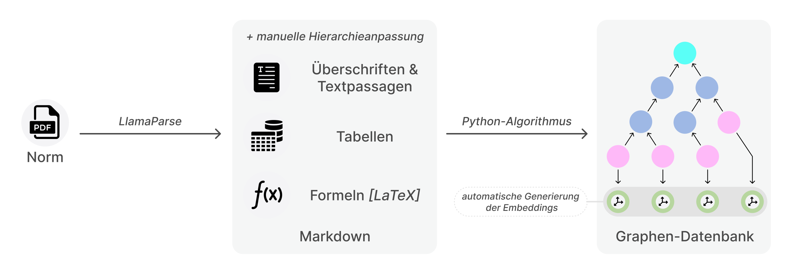
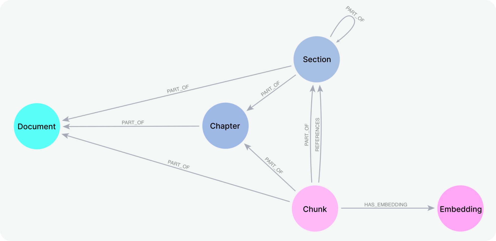

# Data ingestion pipeline

The notebooks in this folder need to be run in advance before the main application can be deployed. 

The folder is structured as follows:
```shell
helper_notebooks_ingestion
├── img
├── markdown_ingestion.ipynb    # Notebook required for ingesting markdown into the neo4j database
└── voyage_embed.ipynb          # Notebook required for creating text embeddings for the contents of the database
```

Steps:
- Use LLamaParse to parse a standards document from PDF to markdown
- follow instructions in `markdown_ingestion.ipynb` to create a hierarchical database conaining the standards data
- follow instructions in `voyage_embed.ipynb` to create the corresponding vector embeddings


## Visualization of the Data ingestion process:


## Database schema of the neo4j graph-database to be created:

